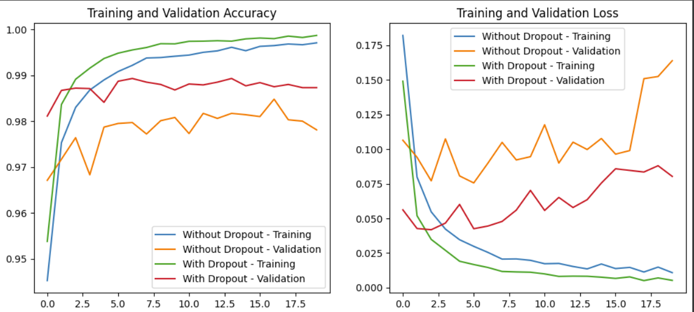

# MNIST Digit Classification with Dense and CNN Models

In this project, we compare two neural network models for classifying handwritten digits from the MNIST dataset using TensorFlow and Keras. The MNIST dataset consists of 60,000 training images and 10,000 test images of digits (0–9).

## Steps of the Code

### 1. Data Loading and Preprocessing
- The MNIST dataset is loaded and normalized by dividing each pixel by 255 to scale the values between 0 and 1.
- The data is reshaped to be compatible with each model:
  - **Model 1 (Fully Connected Network)**: The data is flattened into a 784-element vector (28x28 image).
  - **Model 2 (Convolutional Neural Network with Dropout)**: The data is reshaped to a 28x28 grid with one channel.

### 2. Model 1 - Fully Connected Network
- This model consists of two dense (fully connected) hidden layers, each with 512 neurons and ReLU activation.
- The output layer has 10 neurons with softmax activation for classification into 10 categories (digits 0–9).

### 3. Model 2 - Convolutional Neural Network with Dropout
- This model starts with a 2D convolutional layer with 32 filters and a 3x3 kernel, followed by max-pooling.
- The next layers include two dense layers with ReLU activation and Dropout layers (with a 20% dropout rate) to reduce overfitting.
- The output layer is similar to Model 1, using softmax for classification.

### 4. Training and Evaluation
- Each model is compiled with the Adam optimizer and `sparse_categorical_crossentropy` loss function.
- Models are trained for five epochs with training and validation accuracy/loss recorded.
- After training, the test accuracy is evaluated for both models.

### 5. Visualization of Results
- The training and validation accuracy and loss of both models are plotted for comparison.
- Model 2, which includes Dropout, is expected to perform better in generalization by reducing overfitting.

## Results
- The code outputs test accuracy for both models and visually compares their performance over epochs.
- Model 2, with Dropout, generally shows better validation performance, highlighting the benefits of dropout for reducing overfitting.

